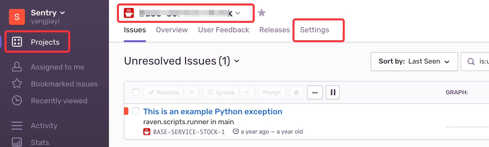
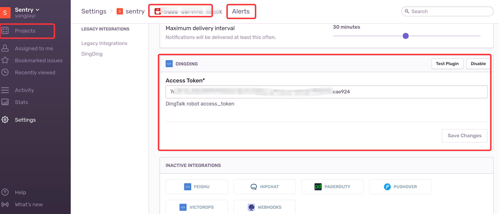

# Sentry-DingDing

`Sentry`的`钉钉`通知插件

## 安装

* 方式1: 进入sentry的安装目录执行一下命令
```bash
$ pip install git+https://github.com/DC-ET/sentry-dingding.git
```

* 方式2: 手动下载本项目, 并拷贝至sentry的安装目录下, 然后在sentry目录下执行以下命令
```bash
$ pip install sentry-dingding
```

## 使用

在`项目`的所有集成页面找到`DingDing`插件，启用，并设置`Access Token`




在插件上使用`Test Plugin`进行测试，当配置好`Access Token`后，在钉钉群内会得到以下警告


点击`href`按钮，打开异常详情页面。


### 如何获取 Access token?

钉钉客户端 > 创建群聊 > 群设置 > 智能群助手 > 添加机器人 > 自定义机器人 > 设置关键词为: alert 并确认 > 得到Webhook参数中的access_token